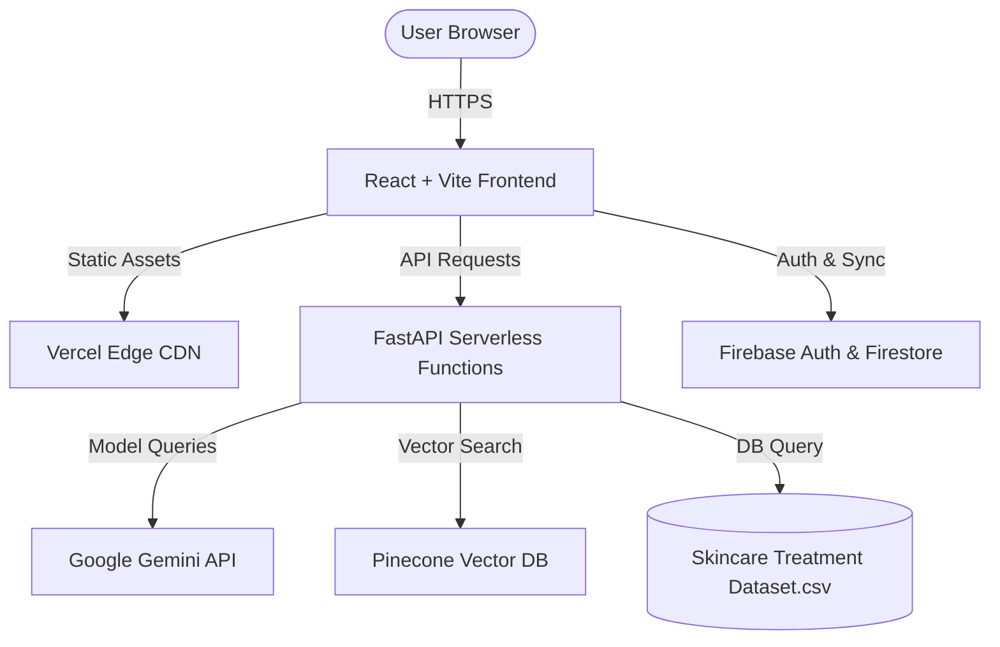

# 🧴 AI-Powered Skincare Assistant & Safety Analyzer

A professional, full-stack AI skincare consultation web application. It features a profile-driven routine generator using real clinical datasets, a real-time chemical active conflict checker, a banned/toxic ingredient safety analyzer based on global standards, and an interactive RAG-powered chatbot.

[](https://deployment-six-xi.vercel.app)
[](https://fastapi.tiangolo.com)
[](https://react.dev)
[](https://deepmind.google/technologies/gemini/)

---

## 🌟 Key Features

### 1. 📋 Skin Profile Routine Suggestor
* **One-Click Generation:** Generates routines directly from your onboarded Skin Profile (Skin Type, Condition/Disease, and Age).
* **Database-Driven Recommendations:** Queries a raw clinical dataset (`Skincare Treatment Dataset.csv`) to fetch clinically backed ingredients suited to your parameters.
* **Safety Integration:** Automatically parses recommended actives to verify they don't conflict with each other or your age group before generating.

### 2. 🧪 Active Ingredient Conflict Checker
* Detects hazardous pairing conflicts in real-time (e.g., *Retinoids + Salicylic Acid*, *Vitamin C + AHAs*).
* Returns severity categories (High Danger, Moderate Danger) along with chemical explanations and spacing recommendations.

### 3. ⚠️ 15 Toxic/Harmful Skincare Watch-list
* Cross-references ingredients against a database of 15 globally restricted/banned chemicals highlighted in the Parama Naturals skincare watch-list (including formaldehyde-releasers, phthalates, sulfates, parabens, synthetic fragrances, and silicones).
* Instantly flags any matching compounds in your pasted ingredient list.

### 4. 💬 RAG Skincare Chatbot
* Powered by Google Gemini.
* Grounded in Pinecone vector search databases containing product catalogs.
* Enforces strict ingredient safety logic directly in system prompts.

---

## 🏗️ Architecture



---

## 🚀 Getting Started

### Prerequisites
* Node.js (v18+)
* Python (3.9+)

### Installation

1. **Clone the repository:**
   ```bash
   git clone <repository-url>
   cd deployment
   ```

2. **Configure Environment Variables:**
   Create a `.env` file in the root folder:
   ```env
   # API Keys
   GEMINI_API_KEY=your_gemini_api_key
   PINECONE_API_KEY=your_pinecone_api_key
   
   # Pinecone Config
   PINECONE_INDEX_NAME=derma-skincare
   PINECONE_NAMESPACE=__default__
   
   # Firebase Config (Used by Frontend Vite build)
   VITE_FIREBASE_API_KEY=your_firebase_api_key
   VITE_FIREBASE_PROJECT_ID=your_project_id
   VITE_FIREBASE_AUTH_DOMAIN=your_project.firebaseapp.com
   ```

3. **Install & Run Backend (Locally):**
   ```bash
   pip install -r requirements.txt
   uvicorn backend.main:app --host 127.0.0.1 --port 8001 --reload
   ```

4. **Install & Run Frontend (Locally):**
   ```bash
   cd frontend
   npm install
   npm run dev
   ```

---

## ☁️ Deployment

This project is configured for single-command deployments on **Vercel** via monorepo builders configuration.

Deploy to production:
```bash
npx vercel --prod
```

### Routing Config (`vercel.json`):
* `/api/*` and `/health` route to serverless Python functions (`api/index.py`).
* All other routes serve static built React SPA files from `/assets/` directly from the Edge CDN.
